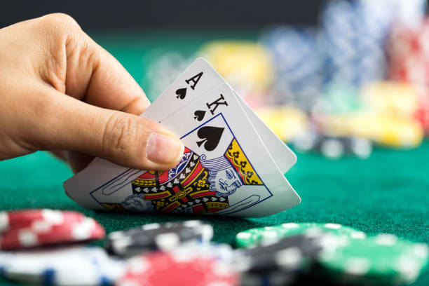

# Blackjack

Blackjack (formerly black jack and vingt-un) is a casino banking game. It is the most widely played casino banking game in the world. It uses decks of 52 cards and descends from a global family of casino banking games known as "twenty-one".

  

